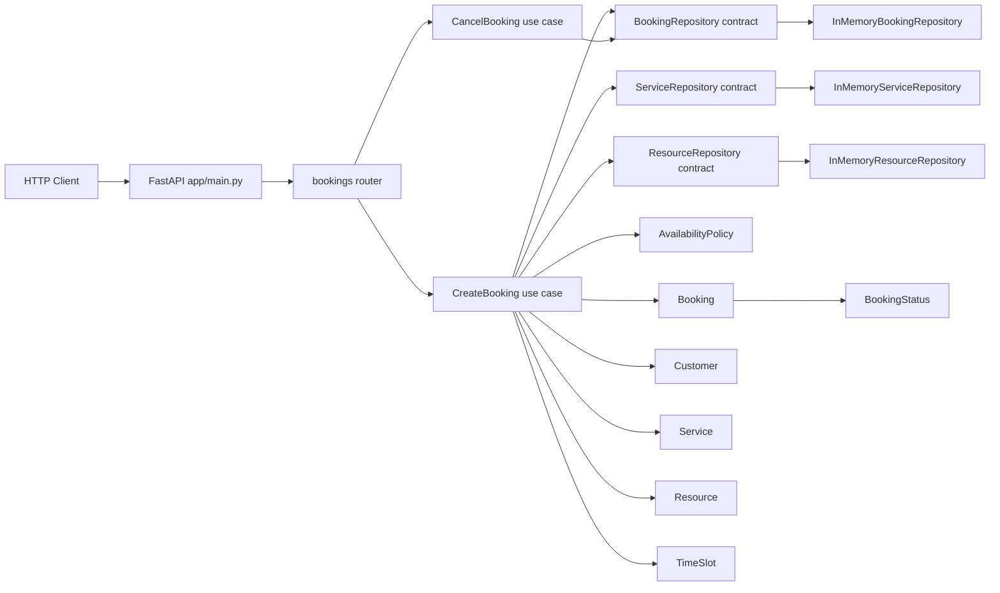
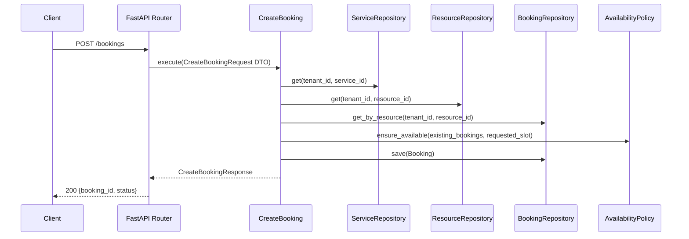

# Architecture AS-IS

## Overview
El proyecto sigue una arquitectura en capas con separación entre `presentation`, `application`, `domain` e `infrastructure`, usando FastAPI como entrada HTTP y repositorios en memoria como persistencia actual.

## Project Structure
```text
Chatbot/
├── app/
│   ├── main.py
│   ├── presentation/http/
│   │   ├── routers/
│   │   │   └── bookings.py
│   │   ├── schemas/
│   │   │   └── booking_schema.py
│   │   └── dependencies.py
│   ├── application/
│   │   ├── dto/
│   │   │   └── create_booking_dto.py
│   │   └── use_cases/
│   │       ├── create_booking.py
│   │       └── cancel_booking.py
│   ├── domain/
│   │   ├── entities/
│   │   │   ├── booking.py
│   │   │   ├── conversation.py
│   │   │   ├── customer.py
│   │   │   ├── resource.py
│   │   │   └── service.py
│   │   ├── repositories/
│   │   │   ├── booking_repository.py
│   │   │   ├── conversation_repository.py
│   │   │   ├── resource_repository.py
│   │   │   └── service_repository.py
│   │   ├── services/
│   │   │   └── availability_policy.py
│   │   └── value_objects/
│   │       ├── booking_status.py
│   │       ├── conversation.py
│   │       └── time_slot.py
│   └── infrastructure/
│       └── persistence/
│           ├── in_memory_booking_repository.py
│           ├── in_memory_conversation_repository.py
│           ├── in_memory_resource_repository.py
│           └── in_memory_service_repository.py
├── main.py
├── pyproject.toml
├── dockerfile
└── docker-compose.yaml
```

## Layered Component Diagram


## Runtime Request Flow (Create Booking)


## Dependency Direction
- `presentation` depende de `application`.
- `application` depende de contratos en `domain`.
- `infrastructure` implementa contratos de `domain`.
- `domain` no depende de capas externas.

## Current Notes
- Persistencia actual: solo en memoria (`in_memory_*`), no base de datos activa.
- Existen carpetas preparadas para crecimiento (`application/conversational`, `application/interfaces`, `infrastructure/providers/*`) sin implementación todavía.
- `main.py` de la raíz es un entrypoint auxiliar y no participa en la API HTTP principal (`app/main.py`).
