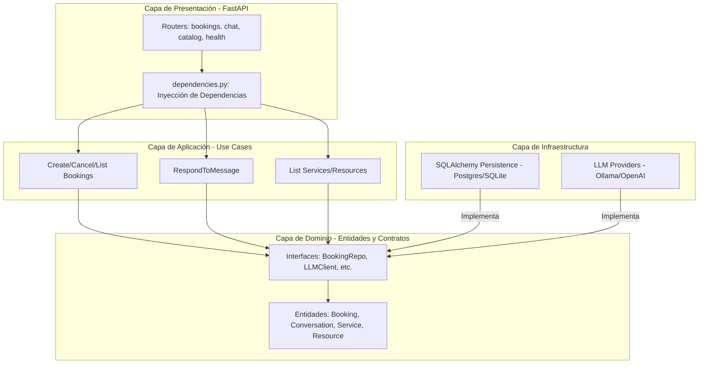
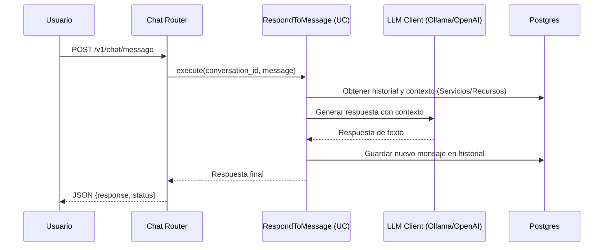

# Architecture AS-IS (Actualizado 2026-03-08)

## Overview

El proyecto es un **Motor de Reservas Conversacional** basado en Arquitectura Hexagonal. Utiliza **FastAPI** para la capa de presentación y **SQLAlchemy** para la persistencia (Postgres/SQLite). La lógica de IA utiliza modelos de lenguaje (LLM) a través de proveedores configurables.

## Project Structure (Actualizada)

```text
Chatbot/
├── app/
│   ├── main.py (Entrypoint con lifespan)
│   ├── presentation/http/
│   │   ├── routers/ (bookings, catalog, chat, health)
│   │   └── dependencies.py (Inyección de dependencias y reset_state)
│   ├── application/
│   │   └── use_cases/ (CreateBooking, RespondToMessage, ListServices, etc.)
│   ├── domain/
│   │   ├── entities/ (Booking, Service, Resource, Conversation)
│   │   └── repositories/ (Interfaces/Contratos de BD)
│   └── infrastructure/
│       ├── persistence/ (Implementación SQLAlchemy + bootstrap/seeding)
│       └── providers/llm/ (Integración con Ollama / OpenAI)
├── chatbot.db (Base de datos local por defecto)
├── docker-compose.yaml (Servicios de Postgres y Ollama)
└── Makefile (Comandos de ejecución)
```

## Layered Component Diagram (Mermaid)

Este diagrama muestra cómo se desacoplan las capas siguiendo los principios de la Arquitectura Hexagonal.



## Runtime Request Flow (Chat)

Flujo dinámico de una interacción típica de un usuario con el chatbot.



## Componentes Clave de Infraestructura

1. **Persistencia SQL**: Implementada con SQLAlchemy. El esquema se genera automáticamente al iniciar la app usando `Base.metadata.create_all`.
2. **LLM Factory**: Sistema que permite intercambiar el motor de IA (ej. cambiar de Ollama local a OpenAI en la nube) mediante variables de entorno.
3. **Bootstrap & Seeding**: Al arrancar, el sistema verifica e inserta un catálogo de prueba (`demo-salon`) para facilitar pruebas inmediatas.

## Notas Actuales de Mantenimiento

- **Entornos**: Controlados vía `.env`. Soporta `DATABASE_URL` para cambiar entre SQLite (desarrollo) y Postgres (producción).
- **Multitenancy**: Todas las tablas incluyen `tenant_id`. Es obligatorio filtrar por este campo en todos los repositorios.
- **Estado de Conversación**: El historial se guarda en la tabla `conversations` dentro de un campo JSON llamado `state`.
